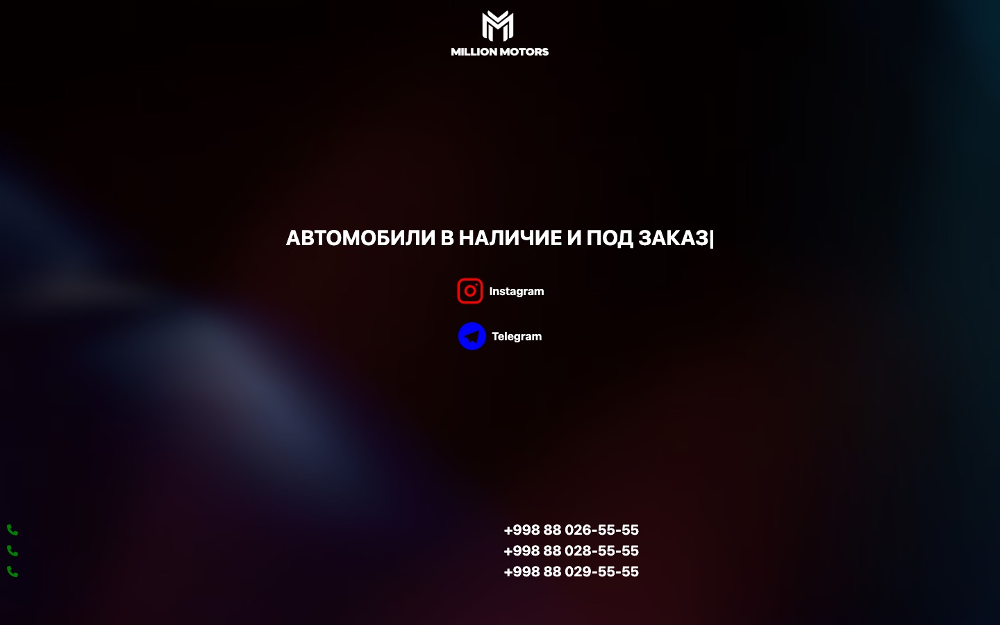

<div align="center">

# Million Motors

**Landing page for a car and EV dealership in Uzbekistan**

[](https://millionmotors.vercel.app)




</div>

A one-screen landing for a real dealership: animated headline with the dealer's key offers,
links to Instagram and Telegram, and tap-to-call phone numbers.

- Typing animation for the offers (`react-type-animation`)
- Entrance animations with Framer Motion variants
- Responsive layout with Tailwind CSS
- Deployed on Vercel

## Run locally

```bash
npm install
npm run dev   # http://localhost:3000
```
